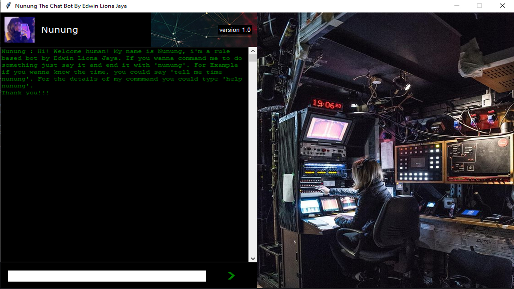
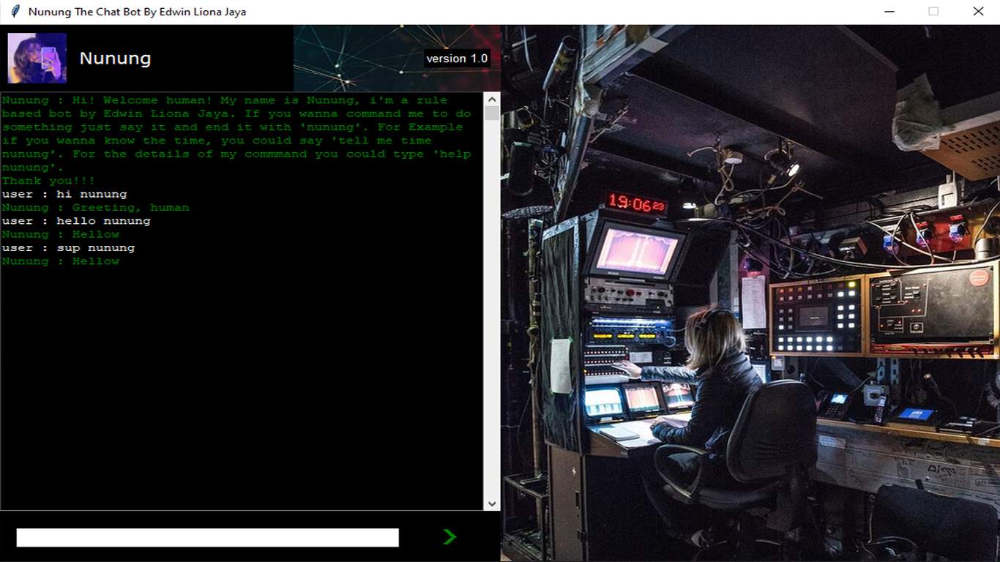
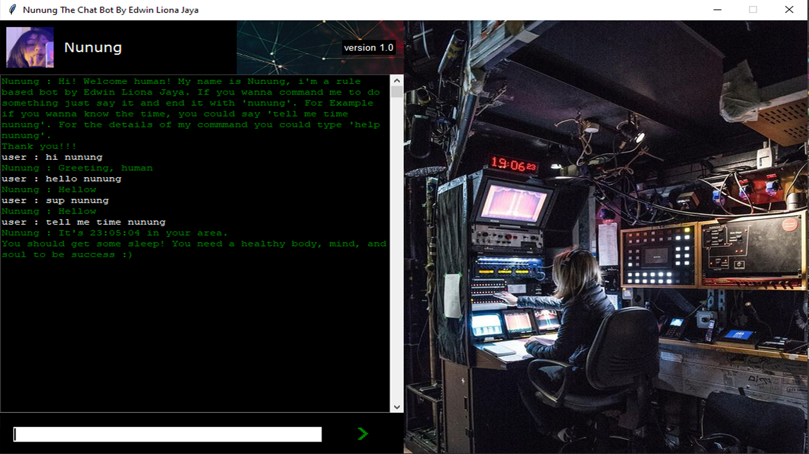
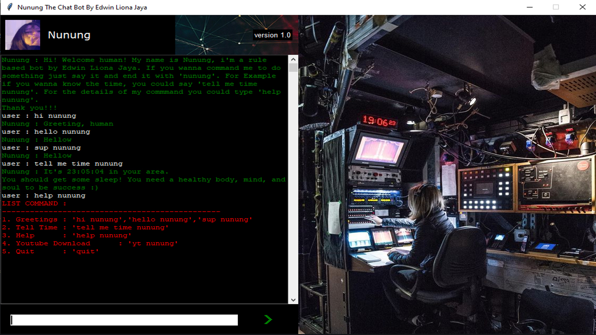
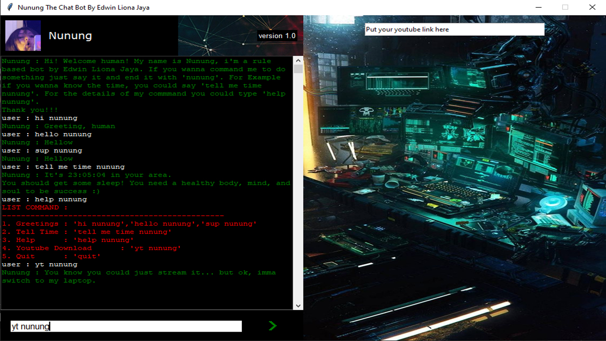
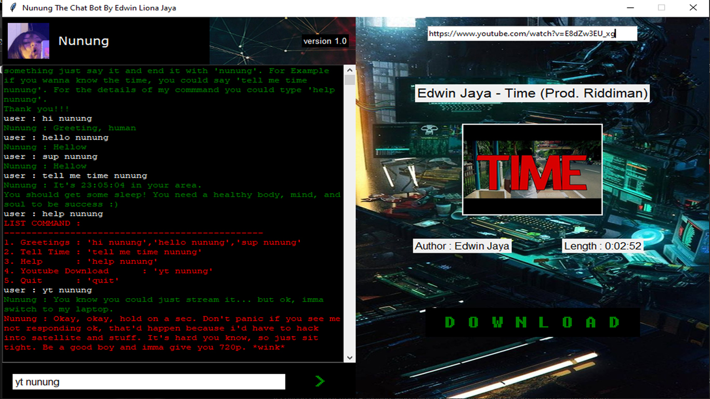

# Nunung The Chat Bot
Python Chat Bot by Edwin Liona Jaya

# Prerequiste 
- Python 3.10 **(This is important because i'm trying using case statement which is not available in the older version of python)**

# Run 
  
  Python app.py

# About 
This chat bot is still in development, right now it's only could do stuff like :

1. Greetings : 'hi nunung', 'hello nunung', 'sup nunung' 
2. Tell Time : 'tell me time nunung'
3. Help      : 'help nunung'
4. Youtube Downloader : 'yt nunung'
5. Quit      : 'quit'

(Without the apostrophe)

In the future i hope to implement ML and turn this Rule Based bot into an AI bot.

# SCREENSHOTS
## START MENU

## GREETINGS COMMANDS

## TIME COMMAND

## HELP COMMAND

## YOUTUBE DOWNLOADER COMMAND

## GET YOUTUBE VIDEO

